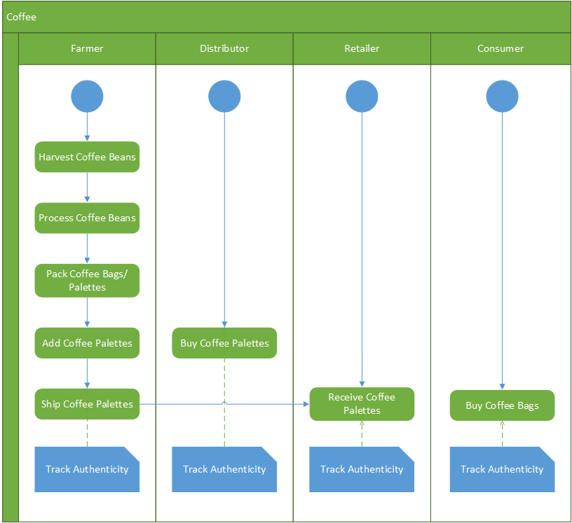
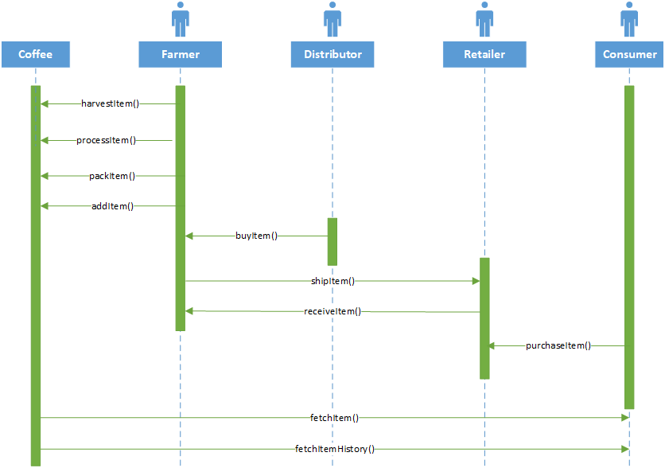
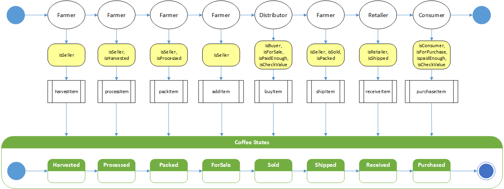
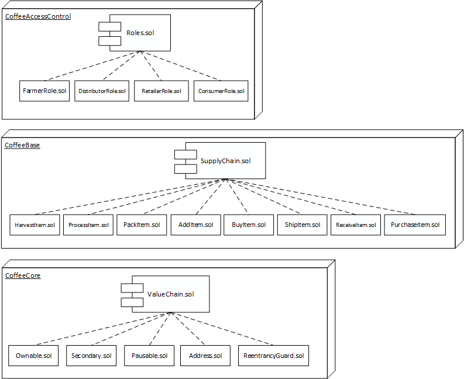
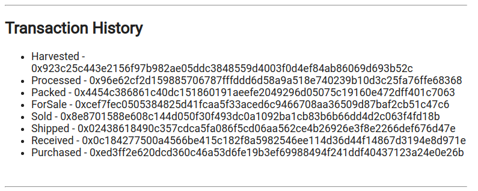

# Architecting a Blockchain Supply Solution


This report describes the architecture of a blockchain solution that tracks the supply of coffee from the Farmer to the Consumer. 


## Project Planning

The following UML diagrams describe the architecture, the processes and the roles involved.

**Activity Diagram**




**Sequence Diagram**




**States Diagram**




**Classes Diagram**




## Smart Contract Development

As shown in the diagrams, the constacts are grouped in the following classes:

- **AccessControl** - Collection of Contracts: These contracts manages the various addresses and constraints for operations that can be executed only by specific roles.
- **Base** - SupplyChain.sol: This is where we define the most fundamental code shared throughout the core functionality. This includes our main data storage, constants and data types, plus internal functions for managing these items.
- **Core** - Ownable.sol: is the contract that controls ownership and transfer of ownership.


The main contract is the `SupplyChain.sol ` one. 

The following four roles are defined:


- **Farmer**: The Farmer can harvest coffee beans, process coffee beans, pack coffee palettes, add coffee palettes, ship coffee palettes, and track authenticity.
- **Distributor**: The Distributor can buy coffee palettes and track authenticity.
- **Retailer**: The Retailer can receive coffee palettes and track authenticity.
- **Consumer**: The consumer can buy coffee palettes and track authenticity.


The smart contract code is implemented in the `contracts` folder. 


## Smart contract testing

To test code verifies the validity of the contract function and lies in the test folder. 

## Smart contract deployment

The contract is deployed in the Rinkeby network, using truffle and Infura.

- **Infura key:**  `7ef91bed5f3a4ae3b4761644e4fd8920`

```
Using network 'rinkeby'.

Running migration: 1_initial_migration.js
  Deploying Migrations...
  ... 0x03ce0f1f4fa19d1fd174d738db7123d15aa13abf7de180122433e1daf756a16c
  Migrations: 0x2c5cac30bceb83c0fca8a7b5c6e57427531a02ef
Saving artifacts...
Running migration: 2_deploy_contracts.js
  Deploying FarmerRole...
  ... 0x9c43562076ab983207194474714f0c34b88fdc9e6db67e51970c6a218d6ce1b7
  FarmerRole: 0xbc528421195b3d6877d7b91b50f964fac1eed6b0
  Deploying DistributorRole...
  ... 0x925dfb325a0369f52ed4524a7dd8d4bb88e4876684fe708e99181196545da3b3
  DistributorRole: 0xc329ee5ff6c0c0d74760f68822f25c122481444c
  Deploying RetailerRole...
  ... 0x1fc4900a379c8d43fb7dedbe576ccfadd35e8d98dbe8cfd07b191c9b4cfa273e
  RetailerRole: 0x11562d275d9ec5a71768ceb490106c7cbe8edb97
  Deploying ConsumerRole...
  ... 0x39f8daf03b3c4fcf19f6abe8cdb03c93ab8eda46b5e15457b2171ccfd94e4afe
  ConsumerRole: 0x8b7732126df05497f212a00fb3a68e2f78f1cc00
  Deploying SupplyChain...
  ... 0xe7a4a4a66ce021d7f137dcbfe7ae139feb13854db24c47d9329ce2e2553b6ba0
  SupplyChain: 0x8c1c8b3a5dcf8d864a53d3ddd55b275c8af168ac
Saving artifacts...
```

And is found in the address:

https://rinkeby.etherscan.io/address/0x8c1C8b3A5DCF8D864A53D3dDD55B275c8Af168ac


## Smart Contract Interaction

The contract is tested locally for the client to interact. The `index.html` file is providing the interface. This is a simple interface where one account, the owner one is used to perform all the actions. In practice however, more accounts are assigned to specific roles and each one can perform the actions that is allowed. 

The following command is run initially to set the accounts: 

`ganache-cli -m "spirit supply whale amount human item harsh scare congress discover talent hamster"`

and the generated accounts are:

```
(0) 0x27d8d15cbc94527cadf5ec14b69519ae23288b95 (~100 ETH) 
(1) 0x018c2dabef4904ecbd7118350a0c54dbeae3549a (~100 ETH)
(2) 0xce5144391b4ab80668965f2cc4f2cc102380ef0a (~100 ETH)
(3) 0x460c31107dd048e34971e57da2f99f659add4f02 (~100 ETH)
(4) 0xd37b7b8c62be2fdde8daa9816483aebdbd356088 (~100 ETH)
...
```

and are assigned to the roles:

```
0: Owner
1: Farmer
2: Distributor
3: Retailer
4: Consumer
```

In this example, only the owner account is used to perform the actions and the log is :



### Tools and packages

The following tools are used:

- Truffle v4.1.15 (core: 4.1.15)
- Solidity v0.4.25 (solc-js)
- npm@6.7.0 
- web3@1.0.0-beta.46